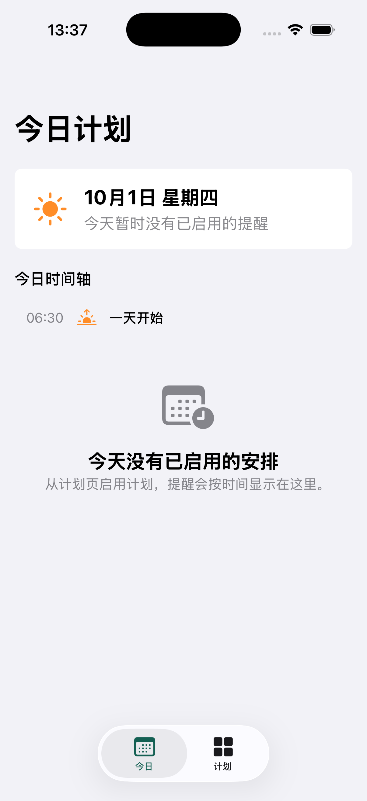
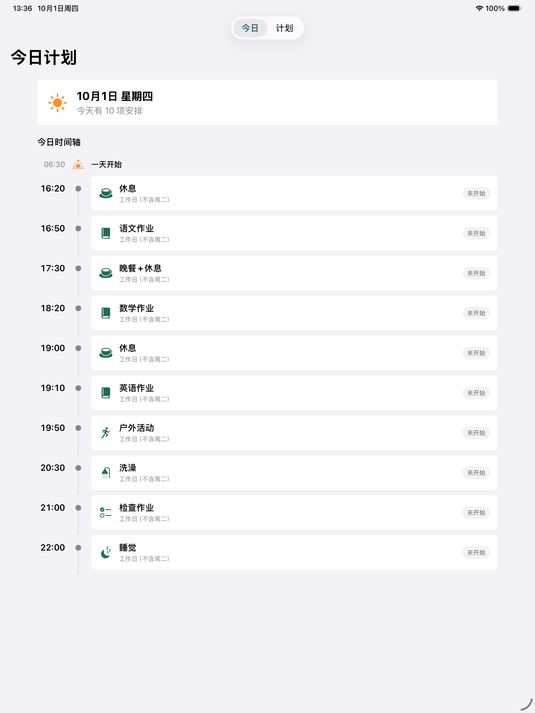
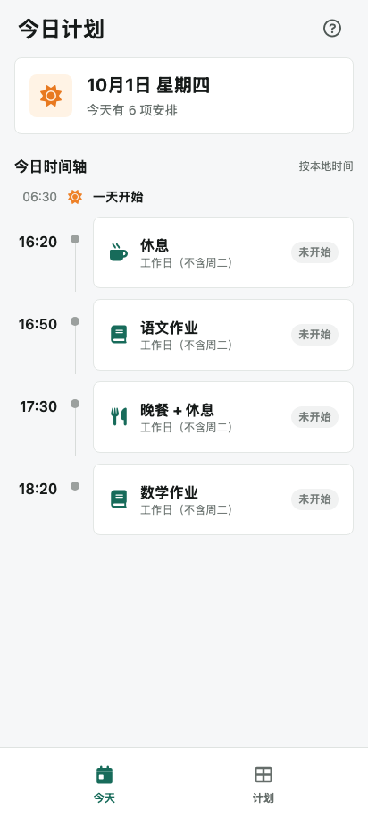

<p align="center">
  
</p>

<h1 align="center">StudyBuddy</h1>

<p align="center">
  <strong>学习计划交给系统准时提醒</strong>
</p>

<p align="center">
  <a href="https://github.com/xzygis/study_buddy/actions/workflows/ci.yml">
    
  </a>
  <a href="https://github.com/xzygis/study_buddy/actions/workflows/release-android.yml">
    
  </a>
  <a href="https://github.com/xzygis/study_buddy/releases/latest">
    
  </a>
  
  
  
  
</p>

---

StudyBuddy 是一款面向家庭学习安排的原生 iOS、iPadOS 和 Android 应用。你可以将学习、休息和日常活动整理成按周重复的计划，由系统在设定时间准时提醒。

所有数据都保存在设备本地，无需注册账号，也不依赖服务器、网络连接或后台持续运行。

## 核心能力

- 灵活创建多组学习计划，并可随时编辑、复制或删除
- 为每组计划统一设置每周重复日期
- 在单个计划中添加多个提醒，自定义名称和开始时间
- 一键启用或停用整组提醒，并通过 AlarmKit / AlarmManager 交给系统调度
- 创建过程中如有提醒失败，自动回滚整组操作，避免重复或残留闹钟
- 原生适配 iPhone、iPad、Android 手机和平板

## 界面预览

<table align="center">
  <thead>
    <tr>
      <th>iPhone</th>
      <th>iPad</th>
      <th>Android</th>
    </tr>
  </thead>
  <tbody>
    <tr>
      <td></td>
      <td></td>
      <td></td>
    </tr>
  </tbody>
</table>

## 技术栈

| 平台 | 技术 |
| --- | --- |
| iOS / iPadOS | Swift 6、SwiftUI、AlarmKit、iOS 26+、本地 JSON |
| Android | Kotlin 2、Jetpack Compose、AlarmManager、Android 8.0+、DataStore |
| 验证 | XCTest、XCUITest、JUnit、Android Lint |

## 快速开始

```bash
git clone https://github.com/xzygis/study_buddy.git
cd study_buddy

# iOS / iPadOS
open ios/*.xcodeproj

# Android
export JAVA_HOME=$(/usr/libexec/java_home -v 17)
export ANDROID_HOME="$HOME/Library/Android/sdk"
./gradlew :android:assembleDebug
```

Apple 平台使用 Xcode 26 或更高版本。Android 使用 JDK 17 和 Android SDK 34，可将 `android/build/outputs/apk/debug/android-debug.apk` 直接安装到设备。

执行核心测试和无签名设备构建：

```bash
bash ios/scripts/verify.sh
./gradlew :android:testDebugUnitTest :android:lintDebug :android:assembleDebug
```

## 下载安装

签名 Secrets 配置完成后，功能分支的 Pull Request 合并到 `main` 会自动运行测试、生成递增版本号并发布安装包。可从 [Releases](https://github.com/xzygis/study_buddy/releases/latest) 下载：

- iOS / iPadOS：需要 Apple 开发者签名的 IPA
- Android：使用免费的自有 keystore 签名，可长期安装和覆盖升级的 APK

> Ad Hoc IPA 只能安装到描述文件中已登记的设备。AlarmKit 的实际响铃行为仍需在真机上验证。
>
> Android 首个自动版本为 `android-v1.0.0`，后续每次合并自动递增补丁版本；签名密钥必须长期保留。

## 文档

- [iOS / iPadOS 工程说明](ios/README.md)
- [Android 工程说明与免费签名发布](android/README.md)
